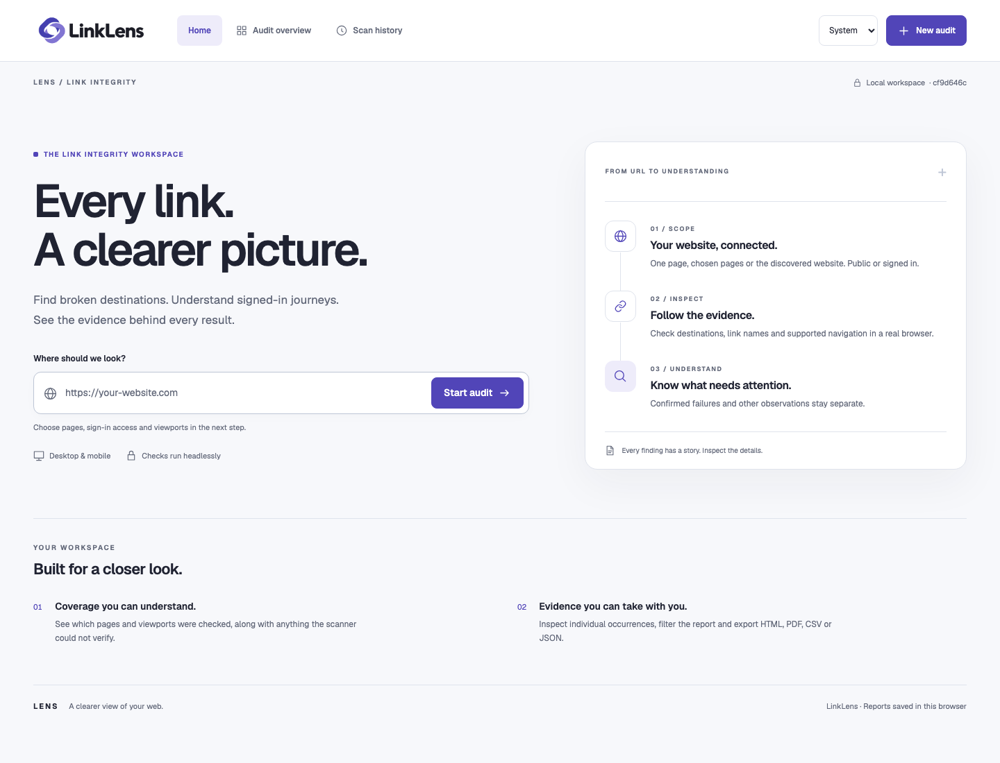
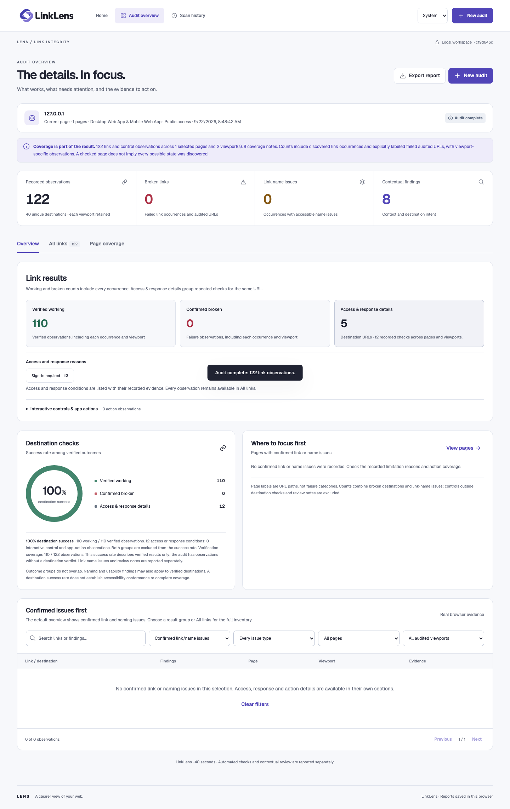
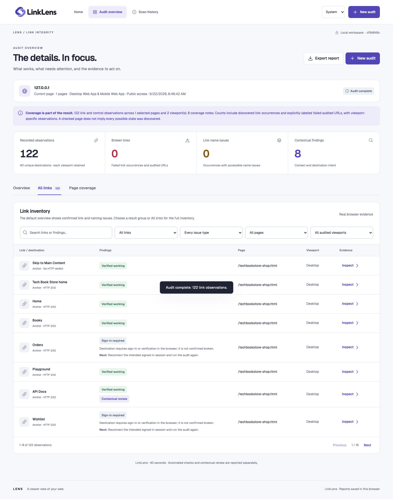
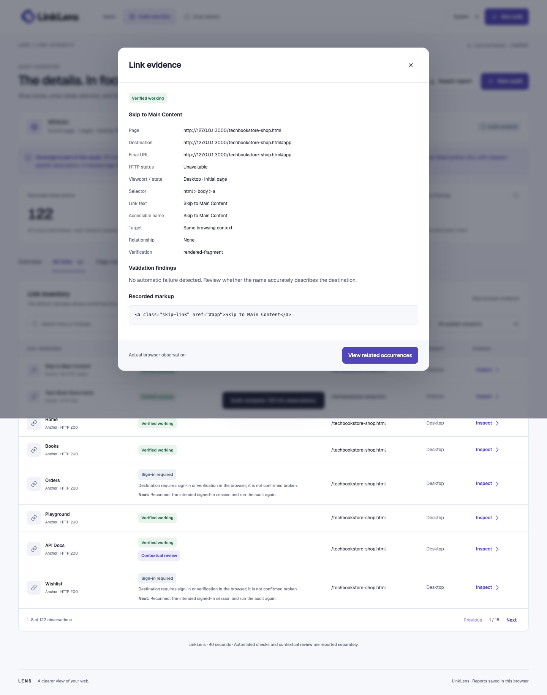
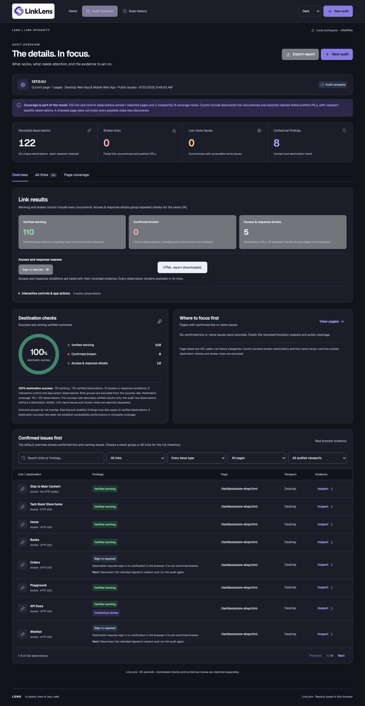
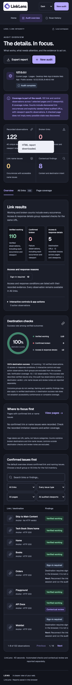

<div align="center">
  
  <h1>LinkLens</h1>
  <p><strong>Every link. A clearer path.</strong></p>
  <p>Verify destinations, inspect browser evidence, and understand link behavior across public and signed-in web applications.</p>
  <p>
    <a href="#installation">Installation</a> ·
    <a href="#how-to-use-linklens">How to use</a> ·
    <a href="#reports">Reports</a> ·
    <a href="#testing-and-validation">Testing</a>
  </p>
  <sub>Version 1.3.1 · Node.js 20+ · Playwright with Chromium</sub>
  <p>
    <a href="CHANGELOG.md"></a>
    <a href="#requirements"></a>
    <a href="#testing-and-validation"></a>
    <a href="docs/demo/index.html"></a>
  </p>
</div>

---

## About LinkLens

LinkLens is a local browser workspace for link integrity audits. It discovers reachable pages, checks destinations in Chromium, and keeps each result connected to its source page, link text, viewport, response, final URL, and recorded markup.

The result model separates **verified working**, **confirmed broken**, and **access and response details**. This keeps authentication requirements, rate limits, special protocols, and supported app controls visible without inflating the broken-link count. Link-name and contextual findings remain available as their own review dimensions.

LinkLens supports public sites and authorized signed-in applications, current-page and whole-site workflows, independent desktop and mobile scans, scan history, and self-contained report exports.

## The LENS Trio

The LENS Trio shares a visual system and an evidence-first approach across three focused quality tools.

| Product | Focus | Repository |
| --- | --- | --- |
| **A11yLens** | Accessibility audit evidence, issue triage, element inspection, and coverage review | [github.com/manjunathnp/A11yLens](https://github.com/manjunathnp/A11yLens) |
| **LinkLens** | Link integrity, destination verification, access conditions, and navigation evidence | [github.com/manjunathnp/LinkLens](https://github.com/manjunathnp/LinkLens) |
| **ImageLens** | Image integrity, responsive resources, text alternatives, and visual evidence | [github.com/manjunathnp/ImageLens](https://github.com/manjunathnp/ImageLens) |

## Screenshots

### Home



### Tech Book Store audit overview



### Link inventory and destination evidence

<table>
  <tr><td width="50%"><strong>Filterable link inventory</strong></td><td width="50%"><strong>Recorded destination evidence</strong></td></tr>
  <tr><td></td><td></td></tr>
</table>

### Desktop and mobile review

<table>
  <tr><td width="72%"><strong>Dark audit overview</strong></td><td width="28%"><strong>Mobile results</strong></td></tr>
  <tr><td></td><td></td></tr>
</table>

These screenshots come from a fresh UI-driven scan of the local **Tech Book Store** storefront at `http://127.0.0.1:3000/techbookstore-shop.html`. The run used current-page scope with desktop and mobile viewports on September 22, 2026.

The unchanged capture records **122 observations** across **40 unique destinations**: **110 verified working**, **0 confirmed broken**, and **12 sign-in-required destination checks**. The success rate among verified outcomes was **100%**. See the [capture provenance](docs/screenshots/capture-provenance.json), [interactive product demo](docs/demo/index.html), [unchanged scan result](docs/demo/capture-result.json), and [self-contained HTML report](docs/demo/tech-book-store-report.html).

## Main features

- Audit the current page, the entire discovered website, or a selected set of pages.
- Scan public websites or connect an authorized browser sign-in session.
- Run desktop, mobile, or combined viewport coverage with independent page state.
- Discover same-origin anchors and supported scripted navigation across application routes.
- Inspect standard links, image-map links, ARIA links, open shadow roots, and accessible frames.
- Detect explicit HTTP failures, redirects, missing fragments, malformed destinations, and empty links.
- Review accessible-name issues, generic labels, keyboard exclusion, new-window notices, and mixed HTTP destinations.
- Separate verified outcomes, confirmed failures, access conditions, and interactive app actions.
- Filter results by result group, reason, issue type, page, viewport, or search text.
- Inspect response evidence, redirect trails, final destinations, selectors, markup, and viewport context.
- Export interactive HTML, PDF, CSV, or JSON reports.
- Save, open, delete, or clear browser-local scan history.
- Use system, light, or dark appearance across responsive layouts.
- Reconnect to active work after a refresh while the local server is running.

## Requirements

- Node.js 20 or newer
- npm
- macOS, Linux, or Windows

LinkLens uses Playwright and Chromium to load pages and verify destinations in a real browser. The project installs Playwright locally.

## Installation

```bash
git clone https://github.com/manjunathnp/LinkLens.git
cd LinkLens
npm install
npx playwright install chromium
npm start
```

Open [http://127.0.0.1:4193](http://127.0.0.1:4193).

The Chromium installation is normally required only once. To use another port:

```bash
PORT=4200 npm start
```

LinkLens listens on `127.0.0.1`, keeping its workspace on the local computer.

## How to use LinkLens

1. Enter a website or page URL.
2. Choose **Public website** or **Browser sign-in**.
3. For browser sign-in, complete the website’s login in the opened browser, select the signed-in application tab when needed, and confirm the connection.
4. Choose **Current page**, **Entire website**, or **Select pages**.
5. Select **Desktop Web App**, **Mobile Web App**, or both.
6. Review the exact pages and viewports, then start the audit.
7. Use the overview, result groups, filters, link inventory, destination evidence, and page coverage to interpret the run.
8. Export the report or return to scan history for later review.

**Entire website** starts from the entered or signed-in page and the origin home page, then explores reachable same-origin links and supported menus across URL paths. **New audit** starts with fresh URL, session, discovery, and page selections.

## Checks and result interpretation

| Area | What LinkLens records |
| --- | --- |
| Destination outcome | Working responses, explicit 404/410 pages, explicit 5xx pages, malformed URLs, empty destinations, and missing same-page fragments |
| Browser navigation | Redirect trail, final URL, rendered error evidence, authenticated destination behavior, and viewport-specific results |
| Link names | Missing names, generic labels, image-link alternatives, and useful contextual evidence |
| Interaction | Supported scripted navigation, tabs, disclosures, menus, keyboard tab exclusion, and new-window behavior |
| Security context | HTTPS pages linking to HTTP destinations and potentially sensitive navigation actions |
| Coverage | Selected pages, desktop/mobile runs, explored states, destination checks, and focused review opportunities |

The primary outcome groups are mutually exclusive:

- **Verified working** contributes to the verified success rate.
- **Confirmed broken** contributes to the broken-link count and verified success rate.
- **Access and response details** preserves sign-in, access-control, timeout, special-protocol, and similar evidence outside the broken count.
- **Interactive controls and app actions** records controls that require application context rather than a direct destination verdict.

Link-name and contextual findings can overlap these outcome groups. The destination success rate is `verified working / (verified working + confirmed broken)` so access conditions do not distort the percentage.

## Reports

| Format | Best for |
| --- | --- |
| **HTML** | A self-contained interactive report with filters, expandable evidence, and filtered CSV download |
| **PDF** | A printable snapshot of the complete audit |
| **CSV** | Sorting occurrences and findings in a spreadsheet |
| **JSON** | Retaining the complete structured audit for another tool or workflow |

Reports can contain private page URLs, link text, selectors, markup, and destination evidence. Review the file before sharing it.

## Privacy and local storage

- LinkLens runs locally and listens only on `127.0.0.1`.
- Credentials are entered into the target website’s browser window, not the LinkLens interface.
- Connected sign-in contexts stay in server memory and expire after 30 minutes of inactivity.
- The browser stores the latest ten completed audits and supports individual or full history deletion.
- Unfinished server jobs remain in memory and clear when the server stops.
- Signed-in browser state is used for the selected audit and is not included in report exports.
- Scanning sends normal browser requests to the selected website; use environments and accounts you are authorized to test.

## Scan Scope and Coverage

- A whole-site run can discover up to 200 same-origin pages and hold up to 3,000 queued candidates.
- Per page and viewport, LinkLens supports up to 24 scroll steps and 16 interaction steps for bounded, repeatable exploration.
- A run can inspect up to 1,500 unique HTTP destinations with up to six continuously scheduled workers.
- Page loading uses a 20-second response window; destination navigation uses a 7-second response window.
- Desktop and mobile selections load as independent browser pages so responsive navigation remains attributable to its viewport.
- Whole-site discovery begins with both the supplied entry point and the site home page, follows canonical redirects, and explores supported nested menus and disclosures.
- Coverage notes preserve sign-in requirements, rate limits, supported-control boundaries, closed shadow roots, canvas content, and custom journeys as focused follow-up opportunities.
- Result counts retain every selected page and viewport occurrence, while repeated destination checks are summarized with their full evidence available.

## Testing and validation

The repository includes thirteen headless suites covering scanner behavior, authentication handoff, destination verification, direct error pages, viewports, whole-site discovery, history, reports, result separation, responsive design, keyboard use, accessibility checks, cancellation, recovery, and running-build identity.

```bash
LINKLENSE_TEST_HEADLESS=1 npm run test:all
npm run test:authentication
npm run test:viewports
npm run test:design
npm run test:rendered-error
```

The reusable test names and expected outcomes are documented in [TEST-CATALOG.md](TEST-CATALOG.md). See [validation evidence](docs/VALIDATION.md), [design validation](DESIGN-VALIDATION.md), and [result separation](RESULT-SEPARATION.md) for the product’s evidence model and executed checks.

## Product demo

Open [docs/demo/index.html](docs/demo/index.html) to explore the captured LinkLens workflow and real Tech Book Store evidence. The standalone demo includes keyboard-operable walkthrough tabs, full-size screenshots, light and dark comparisons, mobile results, the unchanged captured result, and the exported HTML report.

The demo can be opened directly from disk; it does not require the LinkLens server.

## Project files

```text
LinkLens/
├── app.js                         # Application workflow, history, results, and exports
├── server.js                      # Local HTTP server and browser job lifecycle
├── index.html                     # Main application page
├── styles.css                     # Responsive application styles
├── lens-tokens.css                # Shared LENS visual tokens
├── theme.js                       # System, light, and dark appearance
├── src/
│   ├── authentication.js          # Browser sign-in context and transfer
│   └── scanner.js                 # Discovery, interaction, and destination checks
├── tests/                         # Thirteen headless validation suites
├── brand/                         # Approved LinkLens logo assets
├── assets/fonts/                  # Local Geist font and license
├── docs/
│   ├── screenshots/               # README evidence
│   ├── demo/                      # Standalone interactive product demo
│   └── VALIDATION.md              # Captured and automated validation record
├── TEST-CATALOG.md                # Reusable named test scenarios
├── CHANGELOG.md                   # Release history
└── LICENSE.md                     # License terms
```

## Development

LinkLens uses HTML, CSS, JavaScript, Node.js, Playwright, and Chromium. There is no frontend compilation step.

```bash
npm start                          # Start LinkLens on port 4193
npm test                           # Run the core integration suite
LINKLENSE_TEST_HEADLESS=1 npm run test:all
npm run test:design                # Run theme, keyboard, and responsive checks
```

Generated test artifacts are written to `test-output/` and excluded from Git.

## Release history

See [CHANGELOG.md](CHANGELOG.md) for the full release history.

## License

Copyright © 2026 Manjunath N P. All rights reserved. See [LICENSE.md](LICENSE.md).
